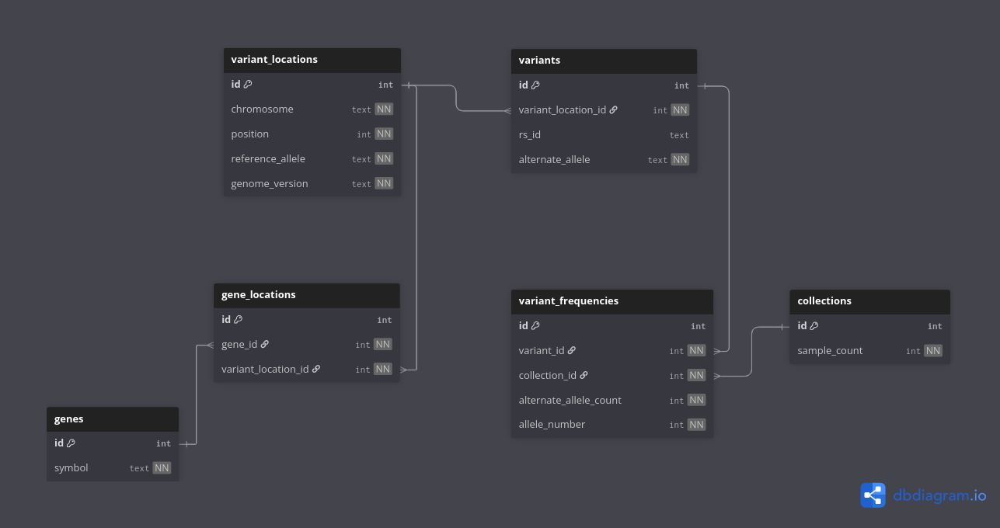

# Genetic Variant Database Schema Documentation

## Table of Contents
- [Overview](#overview)
- [Database Schema Diagram](#database-schema-diagram)
- [Table Descriptions](#table-descriptions)
- [Relationship Explanations](#relationship-explanations)
- [Sample Queries](#sample-queries)

## Overview

This database schema is designed to store genetic variants from VCF files, along with their frequencies across different collections (populations), while also enabling queries based on gene symbols.
## Database E/R Diagram



## Table Descriptions

### 1. positions
Stores the genomic coordinates where variants occur.

| Column | Type | Description |
|--------|------|-------------|
| id | integer | Primary key |
| chromosome | text | Chromosome identifier (e.g., "chr1") |
| start_position | integer | Start coordinate of the variant |
| end_position | integer | End coordinate of the variant |
| reference_allele | text | Reference sequence at this position |

### 2. variants
Stores the actual genetic variants.

| Column | Type | Description |
|--------|------|-------------|
| id | integer | Primary key |
| position_id | integer | Foreign key to positions table |
| rs_id | text | dbSNP reference SNP ID (when available) |
| alternate_allele | text | Alternate sequence at this position |

### 3. collections
Stores information about different sample collections/populations.

| Column | Type | Description |
|--------|------|-------------|
| id | integer | Primary key |
| name | text | Name of the collection |
| sample_count | integer | Number of individual samples in this collection |

### 4. variants_frequencies
Junction table that stores the frequency data for variants across different collections.

| Column | Type | Description |
|--------|------|-------------|
| id | integer | Primary key |
| variant_id | integer | Foreign key to variants table |
| collection_id | integer | Foreign key to collections table |
| alternate_allele_count | integer | Count of the alternate allele in this collection |

### 5. genes
Stores gene information.

| Column | Type | Description |
|--------|------|-------------|
| id | integer | Primary key |
| symbol | text | Gene symbol (e.g., "BRCA1") |
| description | text | Description of the gene (when given)|

### 6. gene_positions
Junction table that connects genes to genomic positions.

| Column | Type | Description |
|--------|------|-------------|
| id | integer | Primary key |
| gene_id | integer | Foreign key to genes table |
| position_id | integer | Foreign key to positions table |

## Relationship Explanations

### positions ↔ variants (1:N)
A position can have multiple variants. This happens because at a single genomic position, there can be multiple possible alternate alleles. For instance, at position chr1:1000, the reference allele might be "A", but we could observe variants with "G", "T", or "C" alternate alleles.

### variants ↔ variants_frequencies (1:N)
A variant can have frequency data in multiple collections. This relationship allows us to track how common a particular variant is across different populations or sample groups (different collections may have different frequencies).

### collections ↔ variants_frequencies (1:N)
A collection can contain frequency data for many variants. This relationship allows us to keep track of the different allele frequencies per variant and sample.

### genes ↔ gene_positions (1:N)
A gene can span many positions in the genome.

### positions ↔ gene_positions (1:N)
A position can be associated with multiple genes. This accounts for overlapping genes.

## Sample Queries

### Calculate allele frequency for a specific variant in a specific collection:
```sql
SELECT v.rs_id, v.alternate_allele, 
       c.name AS collection_name,
       vf.alternate_allele_count / (2.0 * c.sample_count) AS allele_frequency
FROM variants v
JOIN variants_frequencies vf ON v.id = vf.variant_id
JOIN collections c ON vf.collection_id = c.id
WHERE v.rs_id = 'rs123456';
```

### Find all variants in a specific gene with their frequencies:
```sql
SELECT g.symbol AS gene, v.rs_id, v.alternate_allele,
       c.name AS collection,
       vf.alternate_allele_count / (2.0 * c.sample_count) AS allele_frequency
FROM genes g
JOIN gene_positions gp ON g.id = gp.gene_id
JOIN positions p ON gp.position_id = p.id
JOIN variants v ON p.id = v.position_id
JOIN variants_frequencies vf ON v.id = vf.variant_id
JOIN collections c ON vf.collection_id = c.id
WHERE g.symbol = 'BRCA1';
```
